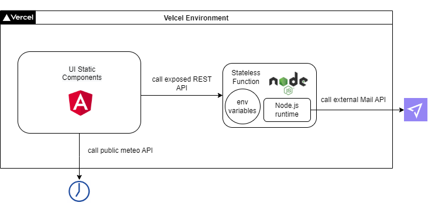

# Angular Portfolio WebApp
This repo contains the side project of my portfolio WebApp which I developed using the Angular framework

The webapp is deployed here: https://portfolio-webapp-spinoniraffaele.vercel.app/ and it is e2e tested over the
following browsers: 

- Chrome
- Firefox
- Edge
- Safari
- Opera
- Brave 

This was intended to be a frontend only application without the need of a backend server.
However, the integration of a 'Contact Me' functionality required a backend able to call a mail API.

The web app is deployed and hosted in [Vercel](https://www.vercel.com) which is offering also a Continuous Deployment environment linked with the GitHub repo of the project.

Vercel is also allowing some 'backend' envinronment called Statelss Functions, thanks to this functionality, the webApp can integrate advanced features such as the 'Contact Me' mailing service.

Here you can find a high-level design of the solution:

### TODO
- Migrate UI test to jest